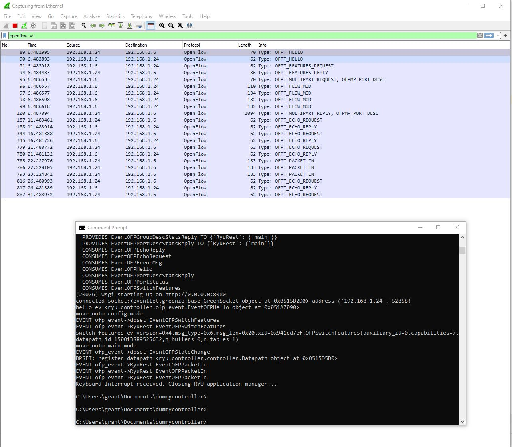

# Dummy Controller

## Overview

## My Configuration

- Controller is running on Windows in PyCharm while I'm testing.
- I am using a S4112F-ON
- I am using a Ryu OpenFlow controller

### Switch Version Info

    Dell EMC Networking OS10 Enterprise
    Copyright (c) 1999-2020 by Dell Inc. All Rights Reserved.
    OS Version: 10.5.1.0
    Build Version: 10.5.1.0.124
    Build Time: 2020-02-12T09:05:20+0000
    System Type: S4112F-ON
    Architecture: x86_64
    Up Time: 00:03:52

### Python Version

    C:\Users\grant\Documents\dummycontroller>python --version
    Python 3.7.0

## Setup

### Setup Controller

    pip install requirements.txt

### Setup OpenFlow on the Switch

#### Enable OpenFlow

On the switch run:

    OS10# configure terminal
    OS10(config)# openflow
    OS10(config-openflow)# mode openflow-only
    Configurations not relevant to openflow mode will be removed from the startup-configuration and system will be rebooted. Do you want to proceed? [confirm yes/no]:yes

#### Configure Management

    OS10(conf-if-ma-1/1/1)# interface mgmt 1/1/1
    OS10(conf-if-ma-1/1/1)# ip address <YOUR_CONTROLLER_IP>/24
    OS10(conf-if-ma-1/1/1)# no shutdown
    OS10(conf-if-ma-1/1/1)# exit

#### Configure OpenFlow Controller

    OS10# configure terminal
    OS10(config)# openflow
    OS10(config-openflow)# switch of-switch-1
    OS10(config-openflow-switch)# controller ipv4 <YOUR_CONTROLLER_IP> port 6633
    OS10(config-openflow-switch)# protocol-version 1.3
    OS10(config-openflow-switch)# no shutdown

## Running the Code

Run `python main.py`

### ** WARNING **

I hard coded the in_ports for the dummy flows in lines 159 and 167. On the 4112F-ON
I have in_ports 5 and 9 are present. Depending on the switch you test, that may or
may not be the case for you. You'll have to update them if those ports aren't present.
If you don't you'll get a BAD_VALUE rejection message from OFPT_FLOW_MOD.

## Seeing the bug:

The flow timeouts are set in lines 175-181:

        # Finally, 0 (lowest) is specified for priority and the add_flow() method is executed to send the Flow Mod
        # message. The content of the add_flow() method is explained in a later section.
        add_flow(datapath, 0, match, actions, 0, 0)

        # Add two flows with very low timeouts to illustrate the problem.
        add_flow(datapath, 2, match_in, actions, 5, 5)
        add_flow(datapath, 2, match_out, actions, 5, 5)

They are the last argument to `add_flow`. The first is the the default flow for
the controller so it is set to infinity. The other two are set to five seconds
both for idle timeout and for hard timeout.

Before running the program, fire up Wireshark and set the filter to `openflow_v4`
Then go and check the switch with `openflow show flows` and verify that no flows
are present. I have written the code to delete any existing flows as the controller
starts up so each time you do this it will be a clean run.

Once you run `main.py` the flows should be present for 5 seconds right after
the controller connects. After that they will disappear again. Start your
capture on Wireshark and then run `main.py`. You'll see the OFPT_FLOW_MOD messages
go out to add the flows. **Make sure you do not see an OFPT REJECT message. This
might be an indicator that you need to update the in_ports**. You can see in Wireshark
that you never go a [flow expiration message](https://ryu.readthedocs.io/en/latest/ofproto_v1_3_ref.html#flow-removed-message) as would be expected.

I have included an EventOFPFlowRemoved handler for experimentation starting on line 184.

## Bug 2

This is not part of tihs thread, but this is another bug I've been meaning to submit.

https://stackoverflow.com/questions/61082548/python-openflow-ryu-breaks-the-frame-check-sequence

At first I thought it was Ryu. I don't think it is - I'm pretty sure it's the behavior
or our switch. When you forward a flow it isn't computing the frame check sequence
correctly so the downstream devices go nuts.